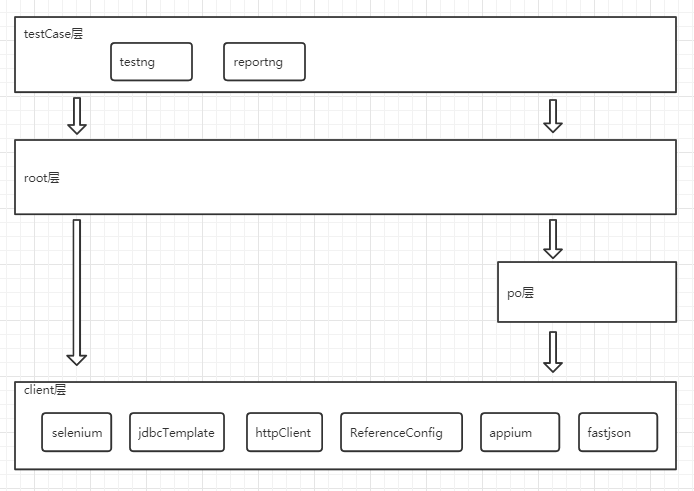

# 一、概述
autotest是一个可以同时实现http、rpc和ui自动化的项目。\
它最大的特点是所有公共方法都通过(统一入口).(客户端对象).(方法)的模式调用。是一个三级树状结构。\
它可以支持：\
1、http接口自动化\
2、dubbo接口自动化\
2、web页面的ui自动化\
3、android app的ui自动化

# 二、调用层级介绍
1、client层  包含所有公用方法，包含 ui操作、sql执行、http接口调用、dubbo接口调用、工具、断言 功能\
2、po层   主要用于ui自动化，也可以按页面细分，非必须\
3、root层  调用根节点，实例化了必要的client类和po类，这层是为了实现三级树状调用结构\
4、testCase层  自动化脚本，支持多应用、全类型同时存在，也支持多线程
